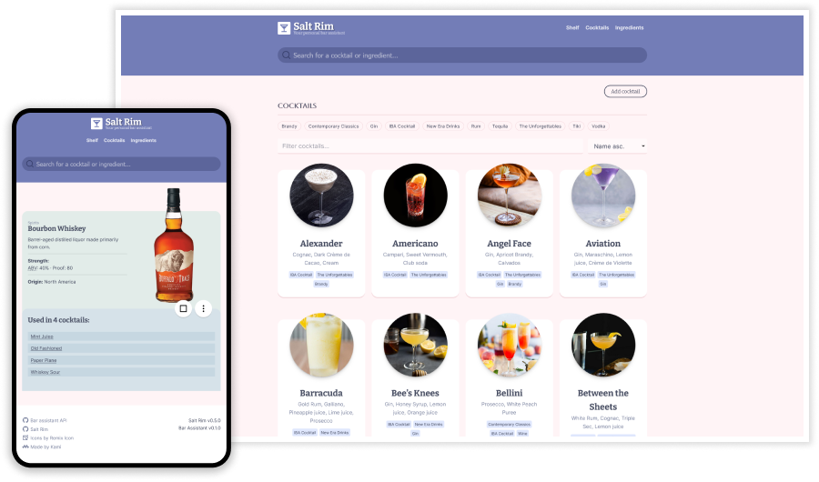

<p align="center">
    <a href="https://karlomikus.com" target="_blank"></a>
</p>

# 🍹 Salt Rim - Bar Assistent Web Client

Salt Rim is a web client used for connecting to your [Bar Assistant](https://github.com/karlomikus/bar-assistant) server. It's made with Vue.js and it builds to a static webpage that can be easily hosted anywhere.

## Features

- Beautiful UI for your Bar Asistant server
- Desktop and mobile support
- Search for cocktails and ingredients using [Meilisearch](https://www.meilisearch.com/) and [Vue Instantsearch](https://www.algolia.com/doc/guides/building-search-ui/what-is-instantsearch/vue/)
- Add, update or delete cocktails and ingredients
- Manage your personal shopping lists
- Save your favorite cocktails
- Markdown support
- Automatically add missing ingredients to your shopping cart
- Implements all supported functionality of Bar Assistant

## Installation

``` bash
$ docker run --name salt-rim -p 80:8080 --env-file ./.env salt-rim
```

Required ENV variables:

TODO

## Contributing

TODO

## License

Salt Rim is open-sourced software licensed under the [MIT license](https://opensource.org/licenses/MIT).
