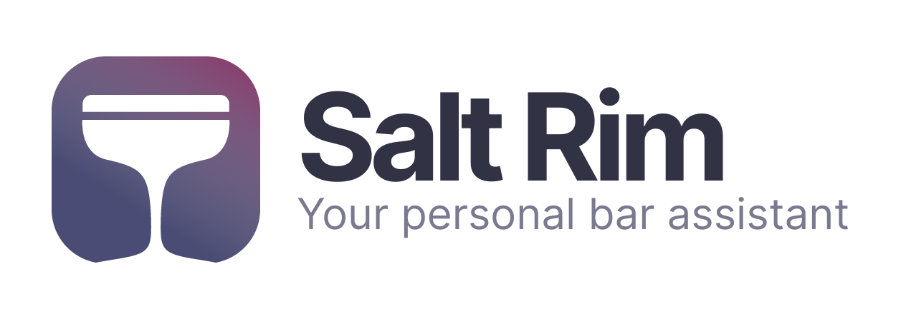
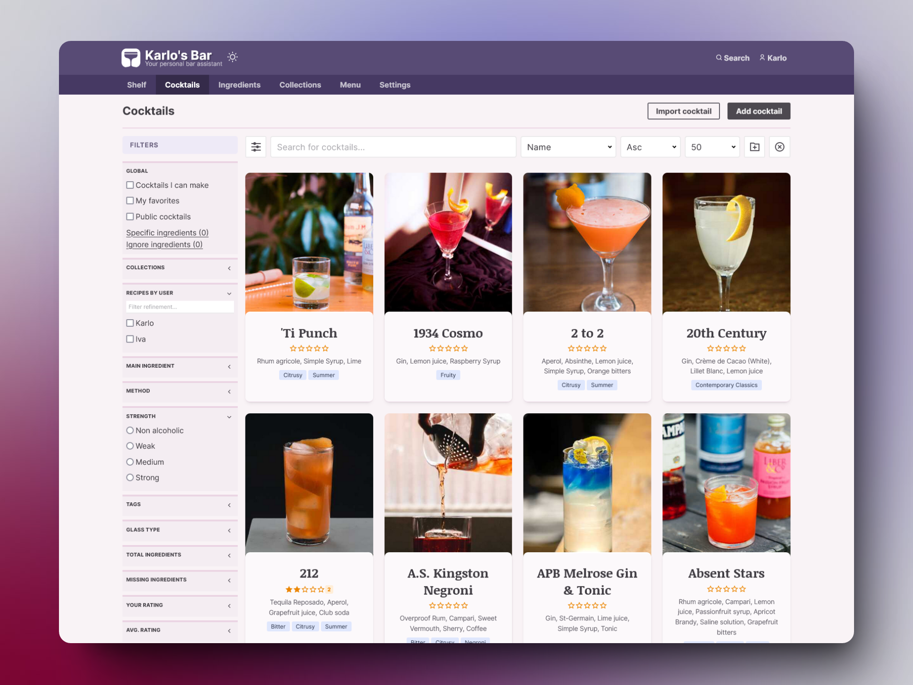

<p align="center">
<a href="https://barassistant.app" target="_blank">
  <picture>
      <source media="(prefers-color-scheme: dark)" srcset="art/logo_dark.png">
      <source media="(prefers-color-scheme: light)" srcset="art/logo.png">
      
  </picture>
</a>
</p>

<p align="center">
    <a href="https://hub.docker.com/r/barassistant/salt-rim"></a>
    
    
    
</p>

# 🍹 Salt Rim - Bar Assistant Web Client

Salt Rim is a web client used for connecting to your [Bar Assistant](https://github.com/karlomikus/bar-assistant) server. It's made with Vue 3 and it builds to a static webpage that can be easily hosted anywhere.

<p align="center">
    <a href="https://demo.barassistant.app" target="_blank">Click here to view frontend demo.</a>
    <br>
    <a href="https://demo.barassistant.app/bar/docs" target="_blank">Click here to view API demo.</a>
    <br>
    <strong>Email:</strong> admin@example.com &middot; <strong>Password:</strong> password
</p>

<p align="center">
    <picture>
      
    </picture>
</p>

## Features

- Intuitive UI for your Bar Assistant instance
- Supports all features of Bar Assistant
- Desktop and mobile support
- Powerful search and filtering capabilities using [Vue Instantsearch](https://www.algolia.com/doc/guides/building-search-ui/what-is-instantsearch/vue/)
- Support for multiple measurement units
- Personal shopping list management and exporting
- Markdown support for cocktails and ingredients
- Automatic ingredient suggestions
- Dark theme support
- Localizations available: English, German, Croatian, French, Polish
- Progressive Web App (PWA) capabilities
- Organize your personal recipe collections
- Easy recipe copying and sharing

## Documentation

[Official documentation is available here.](https://bar-assistant.github.io/docs/)

## Docker installation

Once you have your BA api instance running, you just need to set `API_URL` env variable:

``` bash
$ docker run -d \
    --name salt-rim \
    -e API_URL=http://your-bar-assistant-url \
    -e MEILISEARCH_URL=http://your-meilisearch-url \
    -p 8080:8080 \
    barassistant/salt-rim
```

[For a complete docker compose setup click here](https://github.com/bar-assistant/docker/).

## Manual installation

*This steps will build Salt Rim into a static webpage.*

1. Clone the repository
2. Install the dependencies

``` bash
$ npm install
```

3. Add configuration

Create a new config file in `public/config.js`, with the following content

``` js
window.srConfig = {};
window.srConfig.API_URL = "$API_URL";
window.srConfig.MEILISEARCH_URL = "$MEILISEARCH_URL";
window.srConfig.DEFAULT_LOCALE = "en-US";
window.srConfig.MAILS_ENABLED = false;
```

4. Run the build commands

``` bash
$ npm run build
```

This will create a `dist/` folder with ready to use static files.

5. Or run a dev server with the following command

``` bash
$ npm run dev
```

## Contributing

Fork the respository, follow manual installation steps and make your changes. Issues and PR's are appreciated.

### Internationalization

You can use Crowdin Bar Assistant project, and this will automaticall pull new languages.

<a title="Crowdin" target="_blank" href="https://crowdin.com/project/bar-assistant"></a>

If you want to contribute translations of the UI you can find all the strings that need translations in `src/locales/` directory. Copy one of the locale files and start translating the strings. For extra information you can check out the [i18n plugin this project is using here](https://vue-i18n.intlify.dev/).

## License

Salt Rim is open-sourced software licensed under the [MIT license](https://opensource.org/licenses/MIT).
